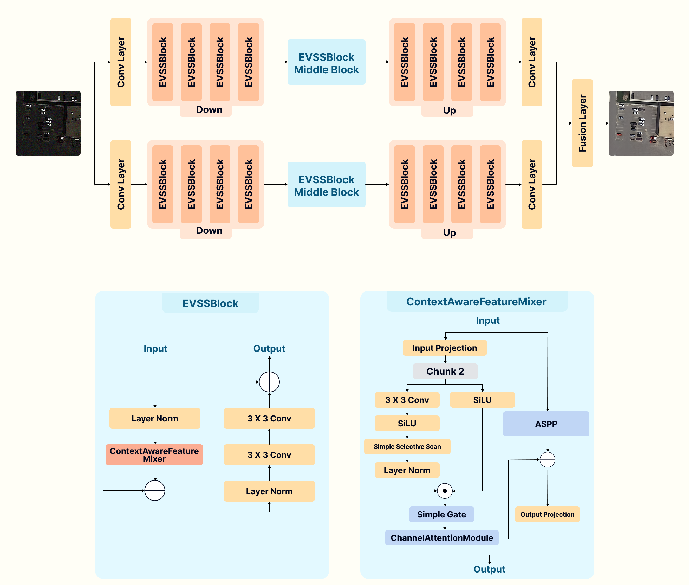
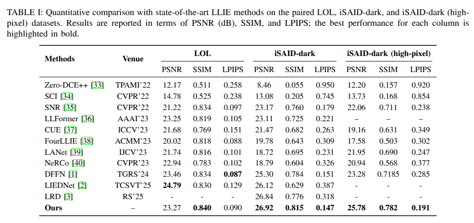

# DBRSNet: Dual-Branch Self-Scanned Visual Attention Network for Low-Light Remote Sensing Image Enhancement

Official PyTorch implementation of **DBRSNet**, a **dual-branch U-Net-style** framework for **low-light nighttime remote sensing image enhancement**.

---

## 🔥 Overview

Nighttime remote sensing images often suffer from underexposure, strong noise, low contrast, and color distortion, which can harm both visual quality and downstream tasks like object detection :contentReference[oaicite:2]{index=2}.  
DBRSNet addresses this using:

- **Dual-Branch Encoder–Decoder (U-Net style)** to jointly model **illumination restoration** and **structural refinement** :contentReference[oaicite:3]{index=3}  
- **EVSSBlocks** with a **Context-Aware Feature Mixer (CAFM)** integrating:
  - **Simple Selective Scanning (SSS)**
  - **Channel Attention (CAM)**
  - **ASPP (multi-scale context)**
  :contentReference[oaicite:4]{index=4}  
- **Night Illumination Restoration Loss (NIRL)** combining **pixel**, **perceptual**, and **frequency-domain** terms :contentReference[oaicite:5]{index=5}  

---

## 🧠 Architecture & Visual Results


**Figure 1:** DBRSNet dual-branch pipeline.


**Figure 2:** Qualitative comparisons.


**Figure 3:** Quantitative comparisons.

---

## 📦 Datasets

This project uses both **paired** and **unpaired** low-light benchmarks (as used in the paper) :contentReference[oaicite:6]{index=6}.

### Paired / Supervised
- **LOL Dataset** (paired):  
  https://drive.google.com/file/d/1L-kqSQyrmMueBh_ziWoPFhfsAh50h20H/view
- **iSAID-dark Dataset** (paired remote sensing):  
  https://drive.google.com/file/d/1mlTTdbqG1ZheaWsBcIjAKDyCdbuAqpvy/view

### Unpaired / No-Reference (Generalization)
- **darkrs Dataset** (real nighttime RS):  
  https://drive.google.com/file/d/1XQGpzB9vDGkO7ULnGOF86cyZdqtrX4tI/view
- **ExDark Dataset** (natural images):  
  https://github.com/cs-chan/Exclusively-Dark-Image-Dataset?tab=readme-ov-file

> Notes:
> - For unpaired datasets, evaluation can be done using **NIQE** (no-reference quality).
> - For paired datasets, common metrics are **PSNR / SSIM / LPIPS**.

---

## 📊 Results and Outputs

We provide comprehensive qualitative and quantitative results for both **paired (reference-based)** and **unpaired (no-reference)** low-light datasets to demonstrate the robustness and generalization capability of **DBRSNet-Dual-Branch**.

---

## 🔹 Paired Datasets (Reference-Based Evaluation)

For paired datasets, ground-truth reference images are available. Performance is evaluated using **PSNR**, **SSIM**, and **LPIPS** metrics.

### 📁 Datasets
- **iSAID-dark**
- **iSAID-dark (high-pixel)**

### 📥 Results Download Links

| Dataset | Resolution | Results |
|-------|------------|---------|
| iSAID-dark | Standard Resolution | 🔗 [Download Results](https://drive.google.com/drive/folders/1oh_hp_s5YUnyiYvtkP7ewxE422Z0mKs3?usp=sharing) |
| iSAID-dark (high-pixel) | High Resolution | 🔗 [Download Results](https://drive.google.com/drive/folders/1acF9DR0vrX2WoR2q-NtjHSd453XfR4cv?usp=sharing) |

> Each results folder contains enhanced images generated by DBRSNet, organized following the original dataset structure for easy comparison.

---

## 🔹 Unpaired Datasets (No-Reference Evaluation)

For unpaired datasets, no ground-truth references are available. Evaluation is conducted using **no-reference image quality metrics**, primarily **NIQE**, alongside qualitative visual comparisons.

### 📁 Datasets
- **darkrs**
- **LIME**
- **NPE**
- **DICM**

### 📥 Results Download Links

| Dataset | Results |
|-------|---------|
| darkrs | 🔗 [Download Results](https://drive.google.com/file/d/1Xu9_3nT6ZbLd6cIXgo4PnmVdqIUU4-Oe/view?usp=sharing) |
| LIME | 🔗 [Download Results](https://drive.google.com/file/d/1U93HRF4LdPdHVV_Coo1lyay9E-u5bjvO/view?usp=sharing) |
| NPE | 🔗 [Download Results](https://drive.google.com/file/d/1YoVyZfW9RauM0RgQ3sqLYhcT-Q8AfTqn/view?usp=sharing) |
| DICM | 🔗 [Download Results](https://drive.google.com/file/d/1wiPme_xc-JVQqCuh2_EqgPe4zyMQgQcf/view?usp=sharing) |

> These datasets are used to evaluate the generalization performance of DBRSNet on real-world low-light scenes with diverse illumination conditions.

---

## 📝 Evaluation Notes

- **Paired datasets** are evaluated using: **PSNR ↑**, **SSIM ↑**, and **LPIPS ↓**.
- **Unpaired datasets** are evaluated using **NIQE ↓** and qualitative inspection.
- All results are generated using the **same trained dual-branch DBRSNet model**, without dataset-specific fine-tuning.

---

## 🎯 Downstream Task: Object Detection with YOLOv12

To verify that the enhanced images are not only visually improved but also **beneficial for downstream vision tasks**, we evaluate **object detection performance using YOLOv12**.  
We run YOLOv12 on three versions of the same validation set:

- **Night**: original low-light/night images (baseline)
- **DBRSNet**: images enhanced by our DBRSNet-Dual-Branch model
- **GT**: corresponding ground-truth / well-lit images (upper bound reference)

This provides a clear comparison of how enhancement affects detection quality (e.g., better visibility, clearer edges, improved object contrast).

### 📥 YOLOv12 Detection Outputs (Download Links)

| Folder | Description | Link |
|---|---|---|
| **Night** | YOLOv12 predictions on the original low-light images | 🔗 [Download](https://drive.google.com/drive/folders/1xkfBDKB98xEC-OqCcYb9FkecpU3hk-0B?usp=sharing) |
| **DBRSNet** | YOLOv12 predictions on images enhanced by DBRSNet | 🔗 [Download](https://drive.google.com/drive/folders/17Fm9HbNcQAoLuA6q77yoywIZ2JZ_Fi2B?usp=sharing) |
| **GT** | YOLOv12 predictions on the ground-truth / reference images | 🔗 [Download](https://drive.google.com/drive/folders/1rN2NNkRWmUnSe-317lIy8w1kYK3pZ7wb?usp=sharing) |

> Each folder contains visualization images (e.g., `val_batch*_pred_*.jpg/png`) with predicted bounding boxes and class labels.

### 📝 Notes
- If DBRSNet improves detection, you should observe **more correct detections**, **higher confidence**, and **fewer missed objects** compared to the *Night* baseline.
- The *GT* results indicate the expected upper-bound performance when illumination is ideal.

--- 


## 🗂️ Repository Structure (Current)

```text
DBRSNet-Dual-Branch/
├── configs/                 # config files (training/eval)
├── data/                    # dataset placeholders / instructions
├── figures/                 # Arch.png, Qualitative.png, Quantitative.png
├── losses/                  # NIRL + other losses
├── models/                  # DBRSNet + blocks (EVSSBlock/CAFM/SSS/CAM)
├── utils/                   # metrics, io, helpers
├── train.py                 # training entry
├── evaluate.py              # evaluation entry
├── test.py                  # quick testing / inference (optional)
├── requirements.txt
└── README.md
```
---
## ⚙️ Installation
```
git clone https://github.com/AnasHXH/DBRSNet-Dual-Branch.git
cd DBRSNet-Dual-Branch

python -m venv .venv
source .venv/bin/activate

pip install -r requirements.txt
```
---
## 📁 Data Preparation (Recommended Format)

1) Paired datasets (LOL / iSAID-dark)
   Use the following layout:
```text
   data/LOL/
├── train/
│   ├── low/
│   └── high/
└── test/
    ├── low/
    └── high/
   ```
  ```text
data/iSAID-dark/
├── train/
│   ├── low/
│   └── high/
└── val/
    ├── low/
    └── high/

```
Update your config paths in configs/*.yaml accordingly.
---
## 🚀 Training
  ```
python train.py --config configs/config.yaml

  ```
Common options you may expose (depending on your code):

--config

--device cuda

--batch_size 4

--epochs 500

--lr 2e-4
---
## ✅ Evaluation (Paired: PSNR/SSIM/LPIPS)
  ```
python evaluate.py \
  --config configs/eval_isai_dark.yaml \
  --ckpt checkpoints/dbresnet_best.pth
  ```
---
## 🖼️ Inference (Single Folder)
  ```
python test.py \
  --ckpt checkpoints/dbresnet_best.pth \
  --input_dir  path/to/low_light_images \
  --output_dir outputs/
  ```
---

## 📌 Citation
If you use this work, please cite:
  ```
@article{ali_dbrsnet_2025,
  title   = {Dual-Branch Self-Scanned Visual Attention Network for Low-Light Remote Sensing Image Enhancement},
  author  = {Ali, Anas M. and Benjdira, Bilel and Aloqayli, Hamad and Othman, Esam and Boulila, Wadii},
  journal = {Under Review},
  year    = {2025}
}
  ```
---

